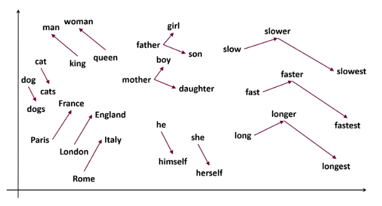
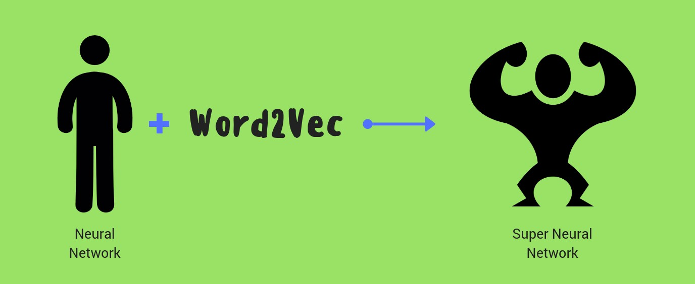
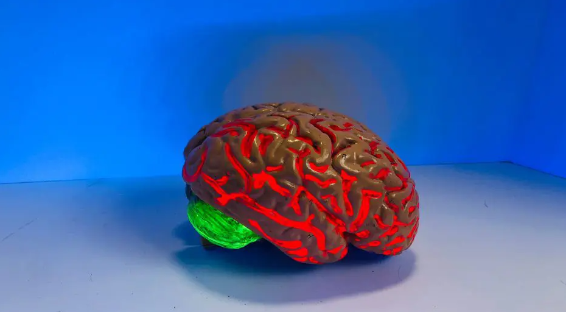
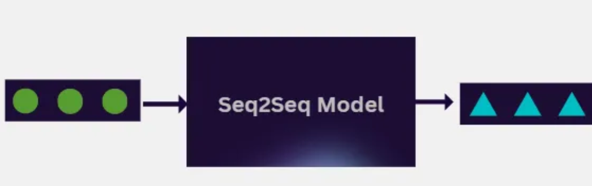

## PLN1 - Procesamiento del Lenguaje Natural I ##

Nombre: José Aviani

Código: a2103

### Desafíos ###

Este repositorio reúne los **cuatro desafíos prácticos** desarrollados para la materia **Procesamiento del Lenguaje Natural 1 (PLN1)**.

Cada desafío aborda un conjunto distinto de técnicas y modelos fundamentales para el PLN moderno: desde vectorización clásica basada en bolsa de palabras, pasando por modelos distribucionales como Word2Vec, hasta modelos de lenguaje recurrentes y finalmente arquitecturas encoder–decoder para traducción automática (*machine translation*).

---

### 📌Desafío 1 — Vectorización, Similitud y Naïve Bayes ###

[Notebook](./Desafio_1.ipynb)

Este desafío introduce la representación tradicional **documento–término**, el uso de **similitud coseno** para analizar vecinos más cercanos y un clasificador **zero-shot** basado en prototipos.

Luego se entrenan modelos **Naïve Bayes** comparando configuraciones de vectorizadores y parámetros, buscando maximizar **F1-macro**.

El mejor resultado provino de **ComplementNB + TF sin IDF**, destacando cómo la frecuencia relativa del término fue más útil que su rareza global.

Finalmente, se evalúa la matriz **término–documento** para estudiar similitudes entre palabras y sus agrupamientos semánticos.

---

### 📌 Desafío 2 — Word2Vec y Análisis de Embeddings ###

[Notebook](./Desafio_2/Desafio_2.ipynb)

En este trabajo se entrenan **embeddings Word2Vec** sobre un corpus de canciones, analizando términos **más y menos similares** y visualizando el espacio vectorial mediante reducción a 2D.

Se estudian clústeres semánticos emergentes y también efectos típicos de corpus pequeños (términos raros o ruidosos).

El desafío incluyó resolver varios aspectos prácticos de entorno y visualización en VS Code, permitiendo una exploración más completa de los embeddings entrenados.

---

### 📌 Desafío 3 — Modelos de Lenguaje a nivel caracteres ###

[Notebook](./Desafio_3/Desafio_3.ipynb)

Aquí se construye un **modelo de lenguaje** basado en **caracteres**, evaluado mediante **perplejidad** en validación.

Se comparan dos arquitecturas:

* **LSTM profunda**, que logra menor perplejidad y secuencias más coherentes,

* **SimpleRNN**, útil como baseline pero limitada para dependencias largas.

Se implementan estrategias de generación (**greedy**, **beam search**, **sampling con temperatura**), observándose las clásicas tensiones entre coherencia, diversidad y repetición.

---

### 📌 Desafío 4 — Traductor Seq2Seq con LSTM ###

[Readme](./Desafio_4/readme.md)

[Notebook parte 1](./Desafio_4/Desafio_4_Keras_Parte1.ipynb)

[Notebook parte 2](./Desafio_4/Desafio_4_Keras_Parte2.ipynb)

Se replica y extiende un traductor **encoder–decoder** con LSTM implementado en **Keras**.

Se experimenta con diferentes valores de **n_units**, embeddings pre-entrenados y estrategias de decodificación (**greedy**, **sampling**, **beam search**).

Aunque el val_loss mejora ligeramente entre la Parte 1 y Parte 2, la calidad de traducción se mantiene similar, reflejando las limitaciones inherentes a los modelos seq2seq simples frente a oraciones largas y errores acumulativos.

---

🔚 Conclusiones Finales

Este repositorio refleja un recorrido por técnicas fundamentales del procesamiento del lenguaje natural:

* Desde **vectorización clásica** y modelos probabilísticos simples,

* pasando por **embeddings distribucionales**,

* construyendo **modelos generativos recurrentes**,

* hasta llegar a un **sistema de traducción automática**.

Cada desafío permitió analizar fortalezas, limitaciones y decisiones de diseño dentro de un flujo completo de experimentación científica: preprocesamiento, modelado, evaluación y conclusiones.

En caso que tengan cualquier duda [jose.aviani@gmail.com](jose.aviani@gmail.com).

### ¡Gracias! ###